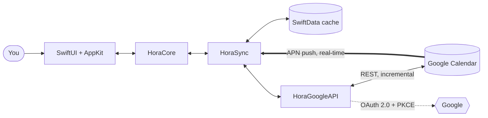

  

<h1 align="center">hora Calendar</h1>

<h3 align="center">
  The Google Calendar client that macOS deserves.
</h3>

  Pure SwiftUI. Direct Google Calendar API. Zero compromises. 
  <strong>No Electron. No CalDAV. Just fast.</strong>

  
  

  
  
  
  
  

  <a href="https://horacal.app"><strong>Website</strong></a> &nbsp;&middot;&nbsp;
  <a href="https://horacal.app/features/">Features</a> &nbsp;&middot;&nbsp;
  <a href="https://horacal.app/blog">Blog</a> &nbsp;&middot;&nbsp;
  <a href="https://discord.gg/8JFz4FfBGQ">Discord</a> &nbsp;&middot;&nbsp;
  <a href="https://horacal.app/privacy">Privacy</a> &nbsp;&middot;&nbsp;
  <a href="https://horacal.app/terms">Terms</a> &nbsp;&middot;&nbsp;
  <a href="https://x.com/moto_szama">@moto_szama</a> &nbsp;&middot;&nbsp;
  <a href="https://bsky.app/profile/szamski.bsky.social">Bluesky</a>

---

  

---

> [!NOTE]
> **hora is native and real-time.** Built in SwiftUI, talking to the Google Calendar REST API directly — no CalDAV translation layer, no web views, no Electron. Changes land instantly via APN push sync instead of polling. It sips battery and opens in milliseconds.

### Why hora

|     | **hora** | Fantastical | Notion Calendar |
| --- | :---: | :---: | :---: |
| Pure SwiftUI + AppKit | Yes | Partly | No |
| No Electron / no web views | Yes | Yes | No |
| Direct Google Calendar API | Yes | CalDAV | Yes |
| Google Meet link on create | One click | Yes | Yes |
| Built-in Pomodoro timer | Yes | No | No |
| Menu bar countdown widget | Yes | Yes | Yes |
| Availability sharing (FreeBusy) | Yes | Yes | Yes |
| Localized languages | 9 | 8 | Limited |
| Pricing | $49 one-time or $30/yr | $100+/yr | Free |

### Keyboard shortcuts

The shortcuts you already know from Google Calendar — natively, everywhere.

  <kbd>D</kbd> Day &nbsp;·&nbsp;
  <kbd>W</kbd> Week &nbsp;·&nbsp;
  <kbd>M</kbd> Month &nbsp;·&nbsp;
  <kbd>T</kbd> Today &nbsp;·&nbsp;
  <kbd>C</kbd> New event &nbsp;·&nbsp;
  <kbd>/</kbd> Search &nbsp;·&nbsp;
  <kbd>J</kbd> / <kbd>K</kbd> Prev / Next &nbsp;·&nbsp;
  <kbd>⌘</kbd><kbd>Z</kbd> Undo &nbsp;·&nbsp;
  <kbd>⌘</kbd><kbd>⇧</kbd><kbd>A</kbd> Share availability

### Features

<strong>15 shipped features</strong> — click to collapse

 

| | Feature | Description |
|---|---|---|
| **Day, Week & Month** | 3 Calendar Views | Apple Calendar–style layout with smooth transitions between views. |
| **Drag & Drop** | Full CRUD | Create, edit, resize, delete events. Feels native because it is. |
| **One Click** | Google Meet | Add conference links when creating events. Join instantly. |
| **D/W/M · C · / · J/K · T** | Keyboard Shortcuts | Google Calendar shortcuts you already know. |
| **Real-time** | APN Push Sync | Apple Push Notifications deliver calendar changes instantly — no polling, no waiting. |
| **Incremental** | Smart Sync | Configurable intervals as a fallback. Native macOS notifications for upcoming events. |
| **Multi-Account** | Color-Coded | Multiple Google accounts, each with its own color scheme. |
| **Autocomplete** | Attendees | Invite people from Google Contacts with instant suggestions. |
| **Pomodoro** | Focus Timer | Built-in pomodoro timer with configurable work/break intervals. |
| **Cmd+Shift+A** | Availability Sharing | Query free slots via FreeBusy API, copy to clipboard. |
| **Menu Bar** | Widget | Pill-shaped indicators, upcoming events, countdown to next meeting. |
| **Recurring** | Events | Full support for recurring rules with exception handling. |
| **9 Languages** | Localization | EN, PL, DE, ES, FR, IT, JA, PT, ZH. |
| **Undo/Redo** | Cmd+Z | Full undo/redo for create, edit, and delete operations. |
| **Light & Dark** | Appearance | Matches system appearance. Polished contrast in both modes. |

See [horacal.app/features](https://horacal.app/features/) for the full list.

### Architecture

Three Swift Packages, one main target. SwiftData is a local cache — Google Calendar is the source of truth.

### Stack

| | |
|---|---|
| Language | Swift 6 |
| UI | SwiftUI + AppKit |
| API | Google Calendar REST API (direct, no CalDAV) |
| Auth | OAuth 2.0 + PKCE via `ASWebAuthenticationSession` |
| Storage | SwiftData (local cache, Google API as source of truth) |
| Architecture | 3 Swift Packages (HoraCore, HoraGoogleAPI, HoraSync) + main target |
| CI/CD | Xcode Cloud (builds + TestFlight) + GitHub Actions (tests on PR) |
| Distribution | Mac App Store / TestFlight |

### Journey

> [!TIP]
> **24+ features shipped, 25+ bugs squashed.** Full changelog on the [blog](https://horacal.app/blog).

<strong>Shipped</strong>

 

Day / Week / Month views · full CRUD · drag & drop · resize · multi-account sync · Google OAuth · incremental sync · keyboard shortcuts · menu bar widget · pomodoro timer · availability sharing · invitation management · calendar visibility · recurring events · 9 languages · light & dark mode · 5/7-day week toggle · one-click meeting join · window state restore · Xcode Cloud CI/CD.

<strong>Working on now</strong>

 

Apple Intelligence — smart scheduling, focus time planning, meeting prep briefings · Quick "Running late" reply · Email attendees from event detail · Invitation "Ignore" option · Light mode contrast polish · Dynamic Dock icon (macOS 26) · Localization native review.

**What's next**

| # | Milestone |
|---|---|
| 1 | Mac App Store launch — final QA sprint, macOS 27 compatibility, performance |
| 2 | iOS & iPadOS companion — same SwiftUI foundation, designed for touch |
| 3 | Google Workspace — Gmail context, contact enrichment, deeper integration |

### Links

| | |
|---|---|
| Website | [horacal.app](https://horacal.app) |
| Blog | [horacal.app/blog](https://horacal.app/blog) ([RSS](https://horacal.app/blog/feed.xml)) |
| Community | [Discord](https://discord.gg/8JFz4FfBGQ) |
| X / Twitter | [@moto_szama](https://x.com/moto_szama) |
| Bluesky | [@szamski.bsky.social](https://bsky.app/profile/szamski.bsky.social) |
| Developer | [szamowski.dev](https://szamowski.dev) |

---

  Built with SwiftUI + AppKit. No Electron. No web views. Pure native macOS.

